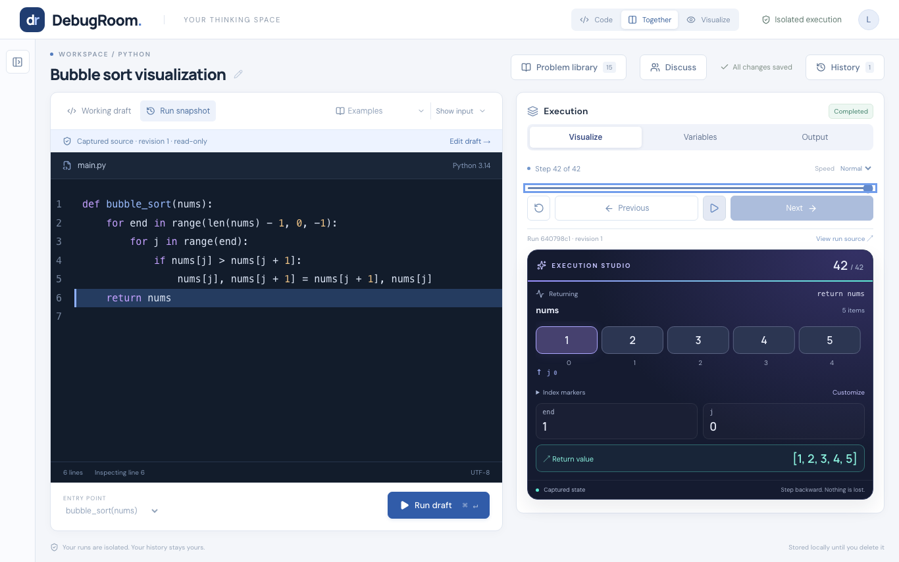
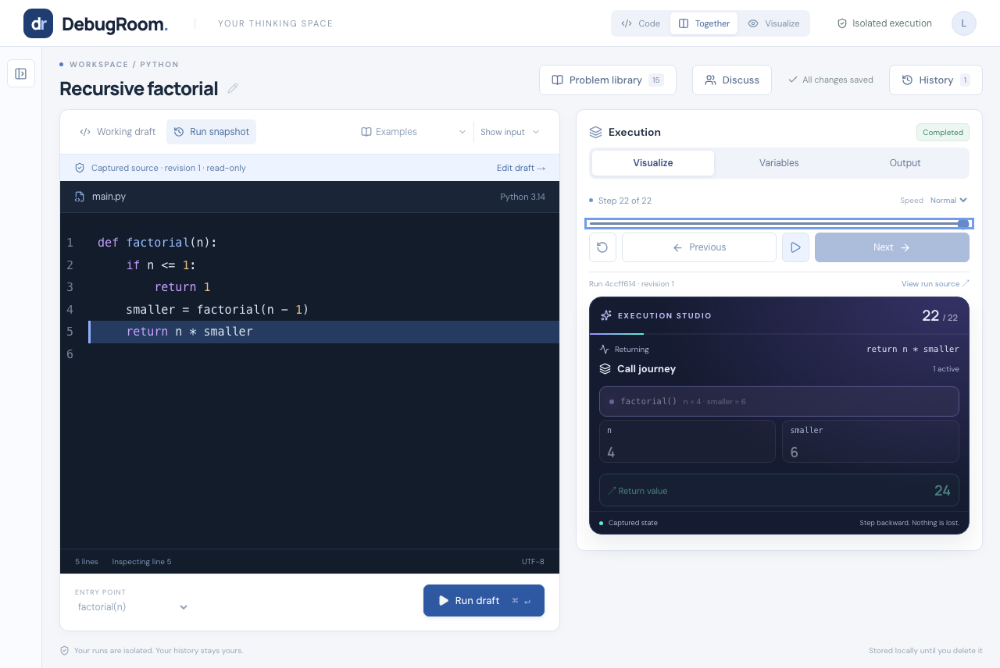
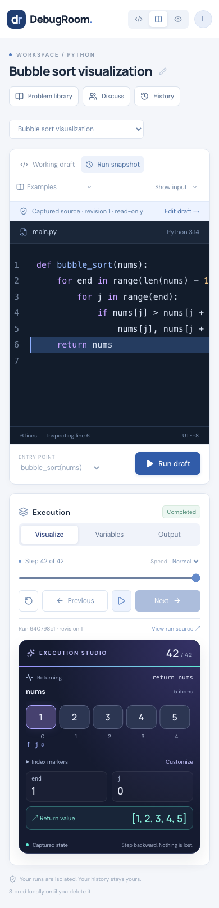

# DebugRoom

DebugRoom is a shared visual workspace for understanding code together. A
student can practice independently, inspect what their program actually did,
and arrive at a tutoring session with a concrete question. Student and mentor
can then edit, run, comment, and visualize from the same saved workspace.



## How it works

1. **Write and run** Python or supported C++ in an isolated container.
2. **Step through execution** with source highlighting, a timeline, variables,
   output, call frames, arrays, linked structures, and trees.
3. **Prepare a question** with investigation notes and comments attached to the
   exact source revision.
4. **Work together** through a private invitation. Both people use the shared
   code and run history; the mentor can keep a separate private experiment and
   share only a hint, selected lines, or a complete copy.

Edits and runs refresh across sessions every few seconds with revision-conflict
protection. Cursor position and playback position are not synchronized live.

## A quick look

| Recursive calls                                                                                                          | Responsive workspace                                                                                          |
| ------------------------------------------------------------------------------------------------------------------------ | ------------------------------------------------------------------------------------------------------------- |
|  |  |

Use **Code**, **Together**, and **Visualize** to give one part of the workspace
more room. The workspace list and input panel stay collapsed until needed.

## Included

- Python functions, scripts, and LeetCode-style `Solution` methods
- C++20 `main()` programs with arrays, vectors, pointers, and LLDB observations
- Immutable run snapshots, autosave, history, comparisons, and exports
- A 15-problem practice library with samples, edge cases, and walkthroughs
- Shared workspaces, source-line comments, mentor notes, and revocable invitations
- PostgreSQL persistence, disposable containers, deadlines, quotas, and recovery

## Run locally

Prerequisites: Node.js 24, Python 3.14, Docker, and gVisor. The tested macOS
setup uses a dedicated Colima VM without mounting the home directory or repo.

```sh
brew install colima docker docker-compose libpq
colima start --profile debugroom --cpu 2 --memory 4 --disk 20 --vm-type vz --mount none --activate=false
colima ssh --profile debugroom -- bash -s < infra/install-gvisor.sh

npm ci
npm run setup:local
npm run dev
```

Open **http://127.0.0.1:5173/**. Local workspaces need no sign-in and persist in
`.data/`. Stop the app with Ctrl+C and stop its VM with:

```sh
colima stop --profile debugroom
```

Re-run `npm run setup:local` after changing a tracer so the worker can pin the
new language image.

## Useful checks

```sh
npm test                 # UI, API, Python, and contract tests
npm run build            # API typecheck and production web build
npm run test:e2e         # full local stack and Playwright Chromium
npm run test:sandbox     # Python container isolation
npm run test:cpp         # C++ container execution
npm run format:check
```

Sandbox checks use `DOCKER_CONTEXT=colima-debugroom`,
`PYTHON_CONTAINER_RUNTIME=runsc`, and `CPP_CONTAINER_RUNTIME=runc`. Use
`PG_BIN=/opt/homebrew/opt/libpq/bin` when PostgreSQL client tools are not on
`PATH`.

## Project notes

- [Verification record](docs/evidence/verification.json) — automated and live
  workflow checks
- [Measured local workload](docs/evidence/local-benchmark.json) — raw benchmark
  environment and samples

The application is implemented and verified locally. Cloud resources have not
been provisioned; GitHub OAuth, AWS deployment, and a real tutoring trial still
need external configuration and validation. Hosted C++ is disabled by default
because the tested gVisor profile does not reliably repeat C++ breakpoints.

DebugRoom does not provide AI hints, automatic grading, external package
installation, or multi-file project imports.
